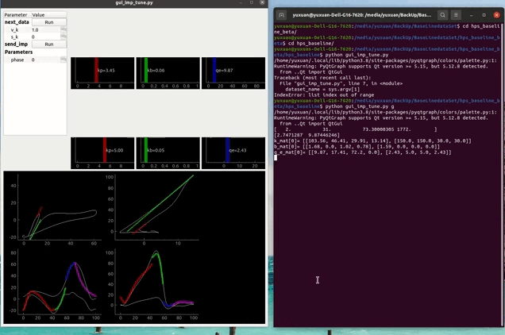
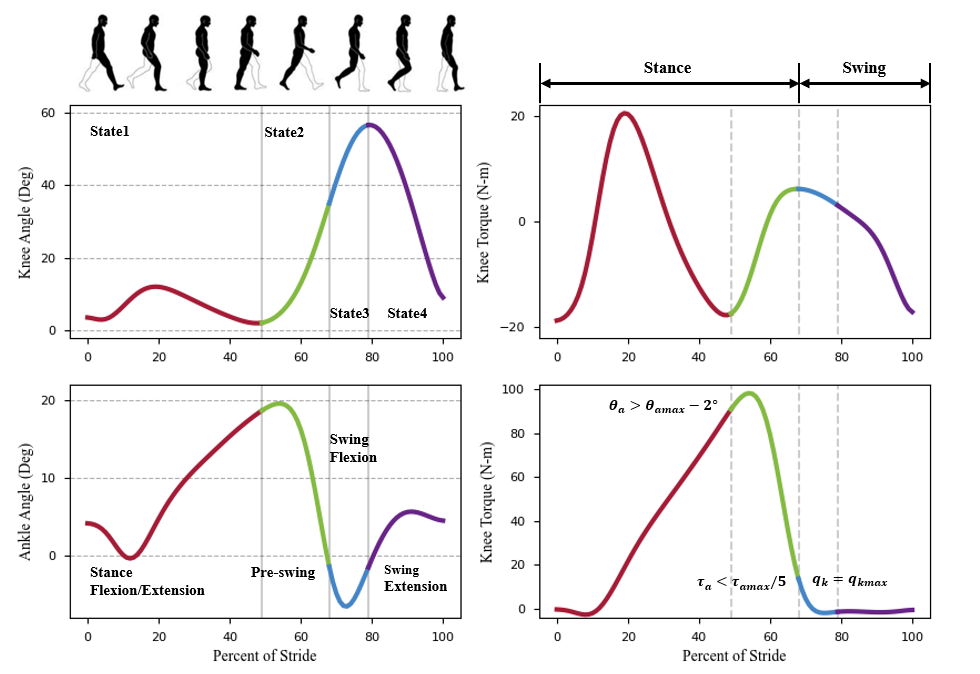

# Hps_Baseline
```shell
cd hps_baseline
# gregg dataset
python gui_imp_tune.py g
# opensource dataset
python gui_imp_tune.py t
```


选择v_k和s_k点击run显示参数，点击send_imp向main_control.py发送参数

选择phase, 拖动竖线条调节相位参数



# Gait Division

